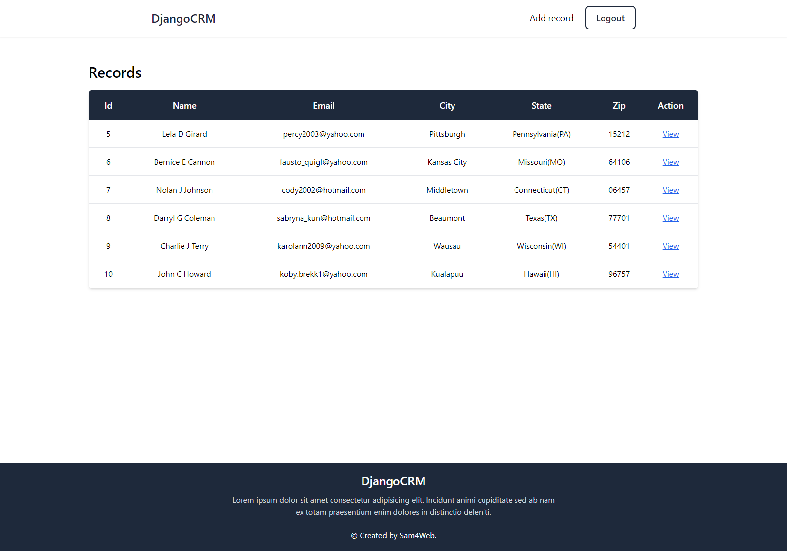

## DjangoCRM

Simple customer relationship management application built using Django & TailwindCSS with basic CRUD functionality and authentication system

### Features

- CRUD Functionality
- Authentication

### Links

[Source code](https://github.com/sam4web/DjangoCRM) (Github)

### How to run it?

1. Clone this repo
   ```bash
   git clone <this-repo>
   ```
2. Setup & activate python env
   ```bash
   cd <this-repo>
   python -m venv env
   source env/Scripts/activate
   ```
3. Install required python modules
   ```bash
   python -m pip install -r requirements.txt
   ```
4. Migrate django models
   ```bash
   python manage.py makemigrations core
   python manage.py migrate
   ```
5. Start django server

   ```bash
   python manage.py runserver
   ```

Open http://127.0.0.1:8000/ to view it in your browser.

### Preview Images


